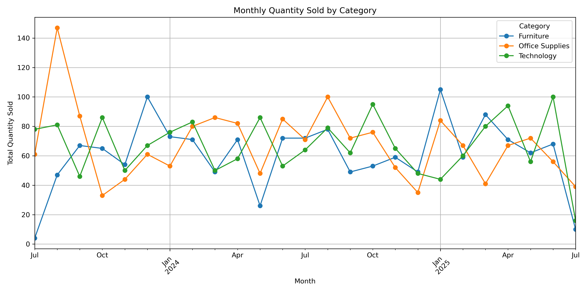
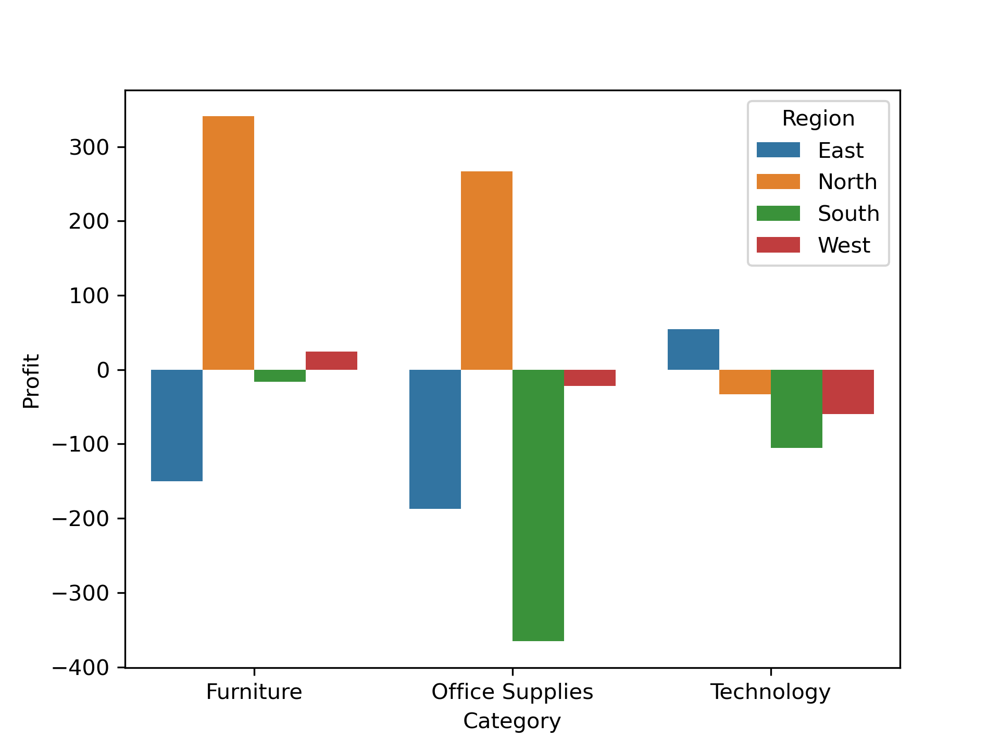

# 🛒 Walmart Sales Data - EDA Project

## 📊 Project Overview
This project explores Walmart sales data to uncover insights, trends, and performance metrics using Python (Pandas, Matplotlib, Seaborn). The focus areas include:
- Monthly sales trends
- Top-performing products and customers
- Region-wise sales performance
- Profit vs Sales analysis

## 📁 Folder Structure
- `01_Dataset & Case_Study/`: Contains raw CSV & Excel format datasets and EDA-Case Study
- `02_Notebook/`: Jupyter Notebook with all the EDA code and visualizations
- `03_Documentation/`: Summary of project for README or report
- `04_Images/`: Plotted Chart images

## 🔧 Tools Used
- Python (Pandas, NumPy)
- Data visualization (Matplotlib, Seaborn)
- Excel (for final reporting)
- Jupyter Notebook (code)

## 📈 Key Insights
- Region `North` had the highest sales but lowest profit margin
- Top 5 products contributed to `40%` of total revenue
- `2024` had more consistent month-over-month growth
- Repeated customer made `9%` of sales and `10.5%` of profit
- Region & Category has `negative correlation` between quantity sold and profit per unit

## 📷 Sample Visuals

| Monthly Sales Trend                                                 |
|--------------------------------------------------------------------|

| Category-Wise Orders                                                  |
|--------------------------------------------------------------------|

## 🚀 How to Run
1. Clone this repo
2. Open `Walmart_EDA_code_visuals.ipynb`
3. Make sure all required libraries are installed
4. Download the dataset and paste the dataset link into df
5. Run the notebook to view insights

## 🙋‍♂️ About Me
Aspiring Data Analyst skilled in Python, Power BI, SQL, and Excel.

## 📬 Contact
**Siddeswaran K**
- Email: [siddesanalyst@gmail.com]
- Contact: [+91 9080526503]
- GitHub: [https://github.com/Siddes-Analyst]
- GitHub Pages: [[your profile](https://siddes-analyst.github.io/02_Walmart_Sales_EDA_Overall/)]
